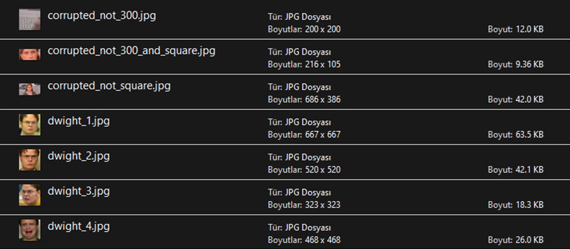

# Face Recognition Project

A simple face recognition application I developed using the Dlib library, ResNet model, and Shape Predictor 68 face landmarks.

*Note: Currently, Dlib does not support numpy 2.0+ updates, so I used numpy version 1.26.4.*

## How to Use the Application:

When you run the ***menu.py*** file located in the *scripts* folder, a window will open. I used images of the characters Michael, Dwight, Jim, and Pam from The Office to recognize Dunder Mifflin employees as examples.

  
Menu

  
  

1. At the top of this window, there is a *Target Size* field. This pixel value checks whether your images are the same size *(target size x target size)*. You can change this value by entering another value and clicking the ***Set Size*** button if desired.

2. In the *data* folder, add images to the *faces* folder for face recognition.
   * These images should be square and contain only a single, complete face.
   * The images can be of different sizes, but they must all be larger than the *Target Size* value.
   * Filenames must start with *“name_”* (e.g. pam_1 or dwight_happy)

  
faces Folder

  
  
  

3. By clicking the ***Check Faces Folder*** button, you can inspect the images you uploaded in the faces folder and detect any that do not meet the rules. Afterwards corrupted files should be fixed or removed. 

  
Check Faces Result

  
  

4. Then, use the ***Resize Images*** button to resize all images in the faces folder to the dimensions *target size x target size*. The resized images will be saved in the *resized_faces* folder within the *data* folder.

  
resized_faces Folder

  
  

5. Click the ***Check Resized Faces Folder*** button to test whether all images are of the specified size and suitable for use.

6. You can upload various photos of people you want to identify into the *test_faces* folder within the *data* folder.

  
test_faces Folder

  
  

7. The *Threshold* value is the threshold between 0 and 1 used during face recognition. You can change this value by entering a new value and clicking the ***Set Threshold*** button.

8. When your images are ready, click the ***Face Recognizer From Folder*** button to start face recognition for all images in the *test_faces* folder. After a certain period, meaningful predictions and the distances to the nearest face for all images in the folder will be displayed in a new pop-up window.

  
Face Recognition Results

  
  

9. With the ***Face Recognizer From Camera*** button, you can perform live face detection and recognition using your computer's camera. You can press the ***esc*** button to close the camera.

  
Face Recognition with Camera Results

  
  

10. The ***Close*** button will terminate the program.
